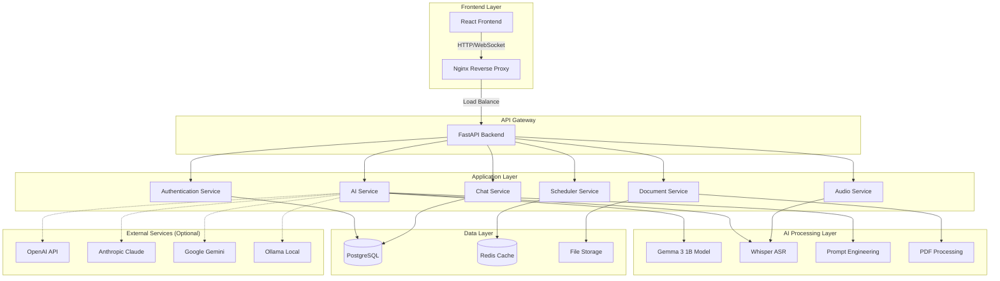

# LLB Architecture Documentation

## System Overview

LLB (爱学伴) is a local AI-driven sexual health education system built with privacy-first principles. The system uses Google's Gemma 3 1B model for natural language processing while maintaining complete data privacy through local processing.

## Architecture Diagram



## Component Architecture

### Frontend (React + TypeScript)
- **Framework**: React 18 with TypeScript
- **State Management**: Redux Toolkit
- **UI Library**: Material-UI (MUI)
- **Styling**: Emotion + Bauhaus Design System
- **Internationalization**: i18next (English/Chinese)
- **Testing**: Vitest + React Testing Library

### Backend (FastAPI + Python)
- **Framework**: FastAPI with async/await
- **Language**: Python 3.11+
- **Database**: PostgreSQL with SQLAlchemy ORM
- **Cache**: Redis for session management
- **Authentication**: JWT with bcrypt
- **API Documentation**: OpenAPI/Swagger

### AI Processing
- **Primary Model**: Google Gemma 3 1B (local)
- **Speech Recognition**: OpenAI Whisper
- **Document Processing**: PyPDF2, pdfplumber
- **Fallback APIs**: OpenAI, Anthropic, Google Gemini
- **Local Inference**: Ollama support

## Service Architecture

### Core Services

#### 1. AI Service (`app/services/ai_service.py`)
- Manages AI model interactions
- Handles prompt engineering
- Provides content safety filtering
- Supports multiple AI providers

#### 2. Audio Service (`app/services/audio_service.py`)
- Voice input processing
- Speech-to-text conversion
- Audio format handling
- Real-time streaming support

#### 3. Document Service (`app/services/document_service.py`)
- PDF document analysis
- Text extraction and processing
- Knowledge base integration
- File upload management

#### 4. Scheduler Service (`app/services/scheduler_service.py`)
- Background task management
- Periodic maintenance jobs
- System health monitoring
- Cache cleanup operations

## Security Architecture

### Authentication & Authorization
- JWT-based authentication
- Role-based access control (RBAC)
- Session management with Redis
- Password hashing with bcrypt
- Optional 2FA support

### Data Privacy
- Local AI processing (no external API calls by default)
- Encrypted data storage
- Secure file upload handling
- Content sanitization
- CORS protection

### Content Safety
- Built-in content filtering
- Age-appropriate responses
- Cultural sensitivity awareness
- Harmful content detection
- Educational focus enforcement

## Deployment Architecture

### Development Environment
```bash
# Local development stack
Frontend: http://localhost:3000 (Vite dev server)
Backend: http://localhost:8000 (Uvicorn)
Database: PostgreSQL (local or Docker)
Cache: Redis (local or Docker)
```

### Production Environment
```bash
# Docker-based production stack
Nginx: Port 80/443 (SSL termination)
Frontend: Static files served by Nginx
Backend: Multiple Uvicorn workers
Database: PostgreSQL with connection pooling
Cache: Redis cluster
```

### Platform Support
- **Linux**: Full support (recommended)
- **macOS**: Full support with Apple Silicon optimization
- **Windows**: WSL2 support
- **Docker**: Multi-platform containers (AMD64/ARM64)