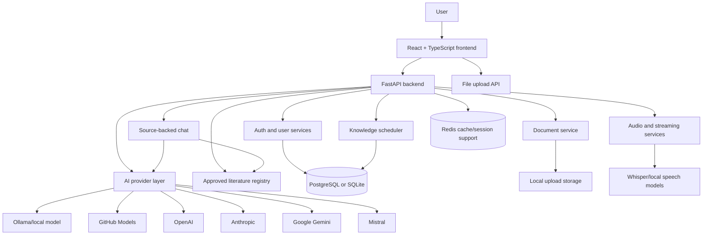
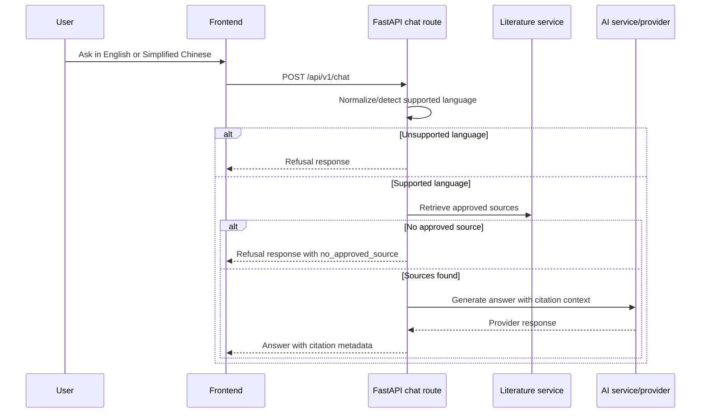
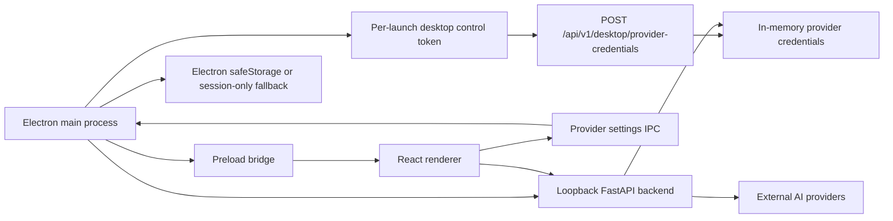
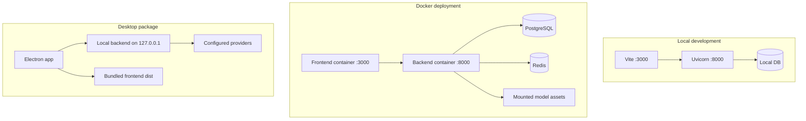

# LLB Architecture

Last updated: 2026-05-16

LLB is a full-stack sexual health education app built around a privacy-first architecture. The web app runs a React frontend against a FastAPI backend. The desktop app wraps the same frontend in Electron and starts a lean local FastAPI backend for source-backed chat and bring-your-own-key AI providers.

## System Overview

```mermaid
flowchart TB
    user[User] --> ui[React + TypeScript frontend]
    ui --> api[FastAPI backend]
    ui --> files[File upload API]

    api --> auth[Auth and user services]
    api --> chat[Source-backed chat]
    api --> ai[AI provider layer]
    api --> audio[Audio and streaming services]
    api --> docs[Document service]
    api --> knowledge[Knowledge scheduler]
    api --> literature[Approved literature registry]

    auth --> db[(PostgreSQL or SQLite)]
    chat --> literature
    chat --> ai
    knowledge --> db
    docs --> storage[Local upload storage]
    audio --> whisper[Whisper/local speech models]

    ai --> ollama[Ollama/local model]
    ai --> github[GitHub Models]
    ai --> openai[OpenAI]
    ai --> anthropic[Anthropic]
    ai --> gemini[Google Gemini]
    ai --> mistral[Mistral]

    api --> redis[(Redis cache/session support)]
```

## Main Components

### Frontend

- React 18, TypeScript, Vite, MUI, Redux Toolkit, i18next, and Vitest.
- Runtime API base URL resolution lives in `frontend/src/config.ts`.
- Key user-facing areas include chat, literature, settings, login, profile/security settings, file upload, and model status views.

### Backend

- FastAPI application factory and router registration live in `backend/app/main.py`.
- Versioned routes are registered through `backend/app/api/v1/api.py`.
- Core services live under `backend/app/services/` for AI, audio, streaming audio, document processing, knowledge updates, scheduling, and literature retrieval.
- Authentication uses JWT-oriented endpoints and dependency helpers in `backend/app/api/deps.py`.

### Desktop

- Electron main process: `desktop/src/main.js`.
- Preload bridge: `desktop/src/preload.js`.
- Backend process helpers: `desktop/src/backend-utils.js`.
- Desktop backend entry point: `backend/desktop_backend_entry.py`.
- Lean desktop FastAPI app: `backend/app/desktop_main.py`.
- Installer targets are configured in `desktop/electron-builder.yml`.

## Source-Backed Chat Flow

```mermaid
sequenceDiagram
    participant U as User
    participant F as Frontend
    participant B as FastAPI chat route
    participant L as Literature service
    participant A as AI service/provider

    U->>F: Ask in English or Simplified Chinese
    F->>B: POST /api/v1/chat
    B->>B: Normalize/detect supported language
    alt Unsupported language
        B-->>F: Refusal response
    else Supported language
        B->>L: Retrieve approved sources
        alt No approved source
            B-->>F: Refusal response with no_approved_source
        else Sources found
            B->>A: Generate answer with citation context
            A-->>B: Provider response
            B-->>F: Answer with citation metadata
        end
    end
```

The chat endpoints intentionally refuse unsupported languages and questions without approved, reviewable sources. Current supported chat languages are English (`en`) and Simplified Chinese (`zh-CN`).

## Desktop Runtime Flow

```mermaid
flowchart LR
    app[Electron main process] --> backend[Loopback FastAPI backend]
    app --> preload[Preload bridge]
    preload --> renderer[React renderer]
    renderer --> backend

    app --> safes[Electron safeStorage or session-only fallback]
    renderer --> ipc[Provider settings IPC]
    ipc --> app
    app --> token[Per-launch desktop control token]
    token --> control[POST /api/v1/desktop/provider-credentials]
    control --> memory[In-memory provider credentials]
    backend --> memory
    backend --> providers[External AI providers]
```

The desktop app keeps the local API on loopback and protects credential updates with `x-llb-desktop-token`. Provider key material is not meant to be stored in browser local storage or exposed through status responses.

## API Surface

The main web backend exposes:

- `/api/v1/auth/*` for login and registration.
- `/api/v1/users/*` for profile, settings, preferences, and account operations.
- `/api/v1/chat`, `/api/v1/chat/languages`, and `/api/v1/chat/status`.
- `/api/v1/ai/*` for provider catalog and protected AI utility endpoints.
- `/api/v1/literature/*` for approved source listing and moderation.
- `/api/v1/knowledge/*` for knowledge entries, scheduler status, and updates.
- `/api/v1/audio-streaming/*` for streaming sessions and WebSocket audio.
- `/api/v1/health`, `/api/v1/health/ai`, `/api/v1/health/audio`, and `/api/v1/health/documents`.
- Legacy `/api/ai/*`, `/api/files/*`, `/api/v1/voice/*`, and `/api/v1/documents/*` routes registered by `backend/app/main.py`.

The lean desktop backend exposes a smaller subset focused on health, provider catalog, chat, literature, and desktop-control credentials.

## Data and Storage

- PostgreSQL is the production database in Docker deployments.
- SQLite can be used for local development paths that do not require the full stack.
- Redis supports cache/session-oriented behavior.
- Uploaded files are stored under `backend/uploads/`.
- Local model assets are expected under `ai/models/` or a configured model path.
- Desktop provider credentials are process-local in the backend and supplied by Electron at launch/runtime.

## Security Model

- Never commit real provider keys, JWT secrets, database passwords, or private user data.
- Protected endpoints use FastAPI dependencies for active-user checks.
- Literature mutation requires admin or moderator privileges.
- Desktop credential endpoints require the per-launch desktop token.
- Chat responses are constrained to supported languages and approved literature.
- File and audio/document paths should continue to validate content type, size, and storage location.

## Deployment Shape

```mermaid
flowchart TB
    subgraph LocalDev[Local development]
        vite[Vite :3000] --> uvicorn[Uvicorn :8000]
        uvicorn --> localdb[(Local DB)]
    end

    subgraph Docker[Docker deployment]
        fe[Frontend container :3000] --> be[Backend container :8000]
        be --> pg[(PostgreSQL)]
        be --> rd[(Redis)]
        be --> models[Mounted model assets]
    end

    subgraph Desktop[Desktop package]
        electron[Electron app] --> localapi[Local backend on 127.0.0.1]
        electron --> bundled[Bundled frontend dist]
        localapi --> external[Configured providers]
    end
```

## Platform Support

- Linux and macOS are first-class development targets.
- Windows is supported through Docker/WSL2 and Electron installer builds.
- Electron installer CI targets macOS DMG, Windows NSIS, and Linux AppImage/deb/rpm.
