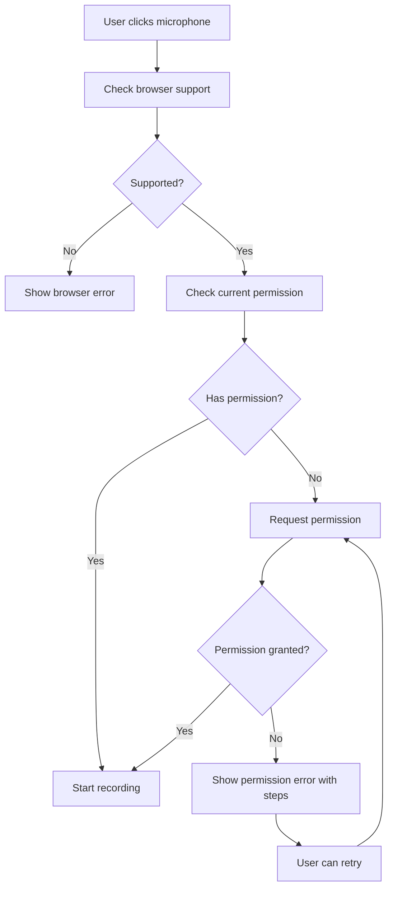
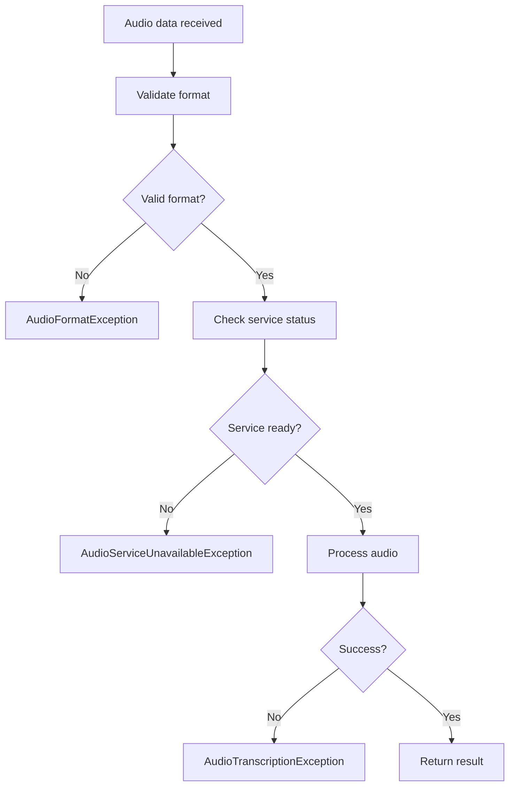

# Audio Error Handling Documentation

## Overview

The LLB application now features comprehensive audio error handling for microphone permissions and audio processing. This system provides better user experience through detailed error messages, troubleshooting guidance, and automatic recovery mechanisms.

## Features

### 🎯 Frontend Improvements

#### 1. Audio Permission Utilities (`frontend/src/utils/audioPermissions.ts`)

**Key Functions:**
- `isBrowserSupported()` - Check browser compatibility
- `getPermissionStatus()` - Get current microphone permission status
- `requestMicrophonePermission()` - Request microphone access with detailed error handling
- `getAudioDevices()` - Enumerate available audio input devices
- `getAudioCapabilities()` - Get comprehensive audio capabilities
- `testMicrophone()` - Test microphone functionality

**Error Types:**
```typescript
enum AudioErrorType {
  PERMISSION_DENIED = 'PERMISSION_DENIED',
  NO_DEVICES = 'NO_DEVICES',
  DEVICE_NOT_FOUND = 'DEVICE_NOT_FOUND',
  DEVICE_IN_USE = 'DEVICE_IN_USE',
  HARDWARE_ERROR = 'HARDWARE_ERROR',
  BROWSER_NOT_SUPPORTED = 'BROWSER_NOT_SUPPORTED',
  NETWORK_ERROR = 'NETWORK_ERROR',
  UNKNOWN_ERROR = 'UNKNOWN_ERROR'
}
```

#### 2. Audio Permissions Hook (`frontend/src/hooks/useAudioPermissions.ts`)

**Features:**
- Automatic permission checking
- Device change detection
- Error state management
- Retry mechanisms
- Capability monitoring

**Usage:**
```typescript
const {
  capabilities,
  isLoading,
  error,
  hasPermission,
  isSupported,
  requestPermission,
  testAudio,
  refreshCapabilities,
  clearError,
  retryLastAction,
} = useAudioPermissions({
  autoCheck: true,
  onPermissionGranted: () => console.log('Permission granted'),
  onPermissionDenied: (error) => console.log('Permission denied:', error),
  onError: (error) => console.log('Error occurred:', error),
});
```

#### 3. Audio Error Handler Component (`frontend/src/components/common/AudioErrorHandler.tsx`)

**Features:**
- User-friendly error messages
- Contextual troubleshooting steps
- Retry functionality
- Expandable help sections
- Different severity levels

**Usage:**
```typescript
<AudioErrorHandler
  error={error}
  onRetry={handleRetry}
  onDismiss={handleDismiss}
  showTroubleshooting={true}
/>
```

#### 4. Enhanced VoiceChat Component

**Improvements:**
- Integrated permission checking
- Better error handling
- Automatic retry mechanisms
- User guidance for permission issues
- Graceful degradation

### 🔧 Backend Improvements

#### 1. Enhanced Exception Classes (`backend/app/core/exceptions.py`)

**New Exception Types:**
- `AudioPermissionException` - Permission-related errors
- `AudioFormatException` - Invalid or unsupported audio formats
- `AudioServiceUnavailableException` - Service not available or initialized
- `AudioTranscriptionException` - Transcription failures
- `AudioTTSException` - Text-to-speech failures

#### 2. Improved Audio Service (`backend/app/services/audio_service.py`)

**Enhancements:**
- Detailed error validation
- Better exception handling
- File format validation
- Service health checking
- Resource cleanup

#### 3. Enhanced API Endpoints (`backend/app/api/ai.py`)

**Improvements:**
- Specific HTTP status codes for different error types
- Detailed error messages
- Better error categorization
- Proper exception mapping

## Error Handling Flow

### 1. Permission Request Flow



### 2. Audio Processing Flow



## Error Messages and Troubleshooting

### Permission Denied
**Message:** "Please allow microphone access in your browser settings and refresh the page."

**Troubleshooting Steps:**
1. Click the microphone icon in your browser's address bar
2. Select "Allow" for microphone access
3. Refresh the page and try again
4. Check your browser's privacy settings

### No Devices Found
**Message:** "No microphone detected. Please connect a microphone and try again."

**Troubleshooting Steps:**
1. Connect a microphone to your computer
2. Check that your microphone is properly plugged in
3. Test your microphone in other applications
4. Restart your browser

### Device In Use
**Message:** "Your microphone is being used by another application. Please close other apps and try again."

**Troubleshooting Steps:**
1. Close other applications that might be using your microphone
2. Check for video calls or recording software
3. Restart your browser
4. Restart your computer if the problem persists

### Browser Not Supported
**Message:** "Your browser does not support audio recording. Please use Chrome, Firefox, or Safari."

**Troubleshooting Steps:**
1. Use Google Chrome, Mozilla Firefox, or Safari
2. Update your browser to the latest version
3. Enable JavaScript in your browser
4. Try using an incognito/private window

## Testing

### Automated Tests

The system includes comprehensive testing capabilities:

1. **Browser Support Test** - Verify audio API availability
2. **Permission Request Test** - Test permission flow
3. **Microphone Test** - Test actual microphone functionality
4. **Audio Capabilities Test** - Verify device enumeration
5. **Voice Recording Test** - End-to-end recording test

### Manual Testing

Use the `AudioErrorTest` component to:
- Test different error scenarios
- Verify error messages and troubleshooting steps
- Check permission flows
- Validate device detection

## Configuration

### Frontend Configuration

```typescript
// Audio permission options
const audioOptions = {
  autoCheck: true,              // Auto-check permissions on mount
  onPermissionGranted: () => {}, // Callback when permission granted
  onPermissionDenied: (error) => {}, // Callback when permission denied
  onError: (error) => {},       // General error callback
};

// Audio constraints
const constraints = {
  audio: {
    echoCancellation: true,
    noiseSuppression: true,
    autoGainControl: true,
    sampleRate: 44100,
  }
};
```

### Backend Configuration

```python
# Audio service settings
AUDIO_SERVICE_CONFIG = {
    "model_size": "base",           # Whisper model size
    "max_file_size": 50 * 1024 * 1024,  # 50MB max file size
    "supported_formats": [".wav", ".mp3", ".ogg", ".m4a", ".flac", ".aac"],
    "timeout": 30,                  # Processing timeout in seconds
}
```

## Best Practices

### 1. Error Handling
- Always check browser support before attempting audio operations
- Provide clear, actionable error messages
- Include troubleshooting steps for common issues
- Implement retry mechanisms for transient errors

### 2. User Experience
- Request permissions only when needed
- Provide visual feedback during processing
- Allow users to dismiss or retry errors
- Show device information when helpful

### 3. Performance
- Clean up audio resources properly
- Use appropriate audio constraints
- Implement timeouts for long operations
- Cache permission status when possible

### 4. Security
- Validate all audio inputs
- Sanitize file uploads
- Implement rate limiting
- Log security-relevant events

## Troubleshooting Common Issues

### Issue: "MediaRecorder is not defined"
**Solution:** Check browser compatibility and ensure HTTPS context

### Issue: Permission denied in Chrome
**Solution:** Check site settings and ensure secure context (HTTPS)

### Issue: No audio devices detected
**Solution:** Verify microphone connection and browser permissions

### Issue: Audio processing fails
**Solution:** Check file format, size limits, and service status

## API Reference

### Frontend APIs

#### `useAudioPermissions(options)`
Hook for managing audio permissions and capabilities.

#### `AudioErrorHandler`
Component for displaying audio errors with troubleshooting.

#### `requestMicrophonePermission(constraints)`
Function to request microphone access with error handling.

### Backend APIs

#### `POST /api/ai/transcribe`
Transcribe audio file with enhanced error handling.

#### `POST /api/ai/text-to-speech`
Generate speech from text with error validation.

#### `GET /api/health/audio`
Check audio service health and capabilities.

## Migration Guide

### From Basic Error Handling

1. Replace simple try-catch blocks with specific error types
2. Update error messages to use the new utility functions
3. Add troubleshooting steps to error displays
4. Implement retry mechanisms

### Example Migration

**Before:**
```typescript
try {
  const stream = await navigator.mediaDevices.getUserMedia({ audio: true });
} catch (error) {
  setError("Microphone error");
}
```

**After:**
```typescript
try {
  const stream = await requestMicrophonePermission({ audio: true });
} catch (error) {
  if (error instanceof AudioPermissionError) {
    // Handle with AudioErrorHandler component
    setError(error);
  }
}
```

## Contributing

When adding new audio features:

1. Use the established error types and patterns
2. Add appropriate error handling and user guidance
3. Include tests for error scenarios
4. Update documentation with new error cases
5. Follow the established UX patterns for error display

## Support

For issues related to audio error handling:

1. Check the browser console for detailed error information
2. Verify browser compatibility and permissions
3. Test with the AudioErrorTest component
4. Review the troubleshooting steps in error messages
5. Check the backend logs for service-related issues 