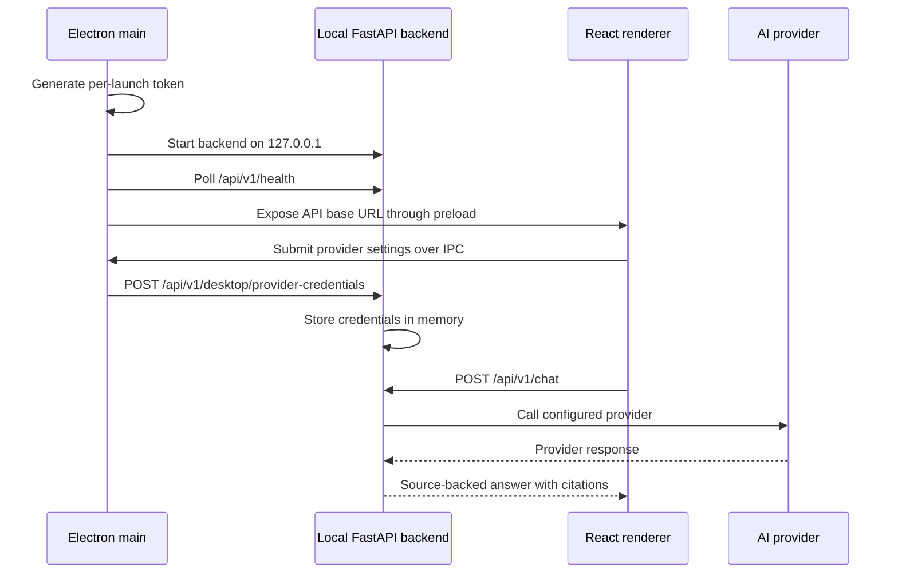

# Electron Desktop AI Provider Design

Last updated: 2026-05-16

## Purpose

LLB ships an Electron desktop app for macOS, Windows, and GNU/Linux. The desktop app loads the React frontend, starts a local FastAPI backend, and lets users provide AI provider credentials without storing key material in browser local storage.

## Goals

- Package LLB as an installable desktop app.
- Start the backend as a local child process so users do not manage a separate server.
- Keep desktop provider credentials local to the machine and masked in status responses.
- Support free-first and BYOK provider order: Ollama/local, GitHub Models, OpenAI, Anthropic, Google Gemini, and Mistral.
- Keep installer size reasonable by avoiding unnecessary full local ML stack bundling.

## Current Implementation

- `desktop/src/main.js` owns Electron lifecycle, backend startup, provider credential IPC, and the per-launch desktop token.
- `desktop/src/preload.js` exposes safe runtime configuration to the renderer.
- `desktop/src/backend-utils.js` chooses the backend executable/script and waits for health.
- `backend/desktop_backend_entry.py` starts `app.desktop_main:app` on `127.0.0.1`.
- `backend/app/desktop_main.py` provides the lean desktop API.
- `backend/app/api/v1/endpoints/desktop.py` accepts desktop provider credentials behind `x-llb-desktop-token`.
- `backend/services/ai_providers.py` keeps desktop credentials in process memory and masks status output.
- `desktop/electron-builder.yml` configures macOS DMG, Windows NSIS, and Linux AppImage/deb/rpm targets.

## Runtime Flow



## Credential Handling

- The renderer must not directly persist provider keys in browser storage.
- Provider settings move from the renderer to Electron through IPC.
- Electron sends credentials to the backend with `x-llb-desktop-token`.
- The backend stores accepted provider credentials in memory.
- Status responses expose provider name, selected model, and whether a key exists, but not the key itself.
- If persistent desktop storage is enabled, Electron should use `safeStorage` or a platform keychain-backed equivalent. If platform encryption is unavailable, use session-only credentials.

## Desktop Backend API

The lean desktop backend exposes:

```http
GET  /health
GET  /api/v1/health
GET  /api/v1/ai/providers
POST /api/v1/chat
GET  /api/v1/chat/languages
GET  /api/v1/chat/status
POST /api/v1/desktop/provider-credentials
GET  /api/v1/literature/sources
POST /api/v1/literature/sources
POST /api/v1/literature/sources/{source_id}/approve
POST /api/v1/literature/sources/{source_id}/archive
```

The desktop backend intentionally avoids importing the full backend application because the full app initializes heavier local ML/audio services.

## Provider Precedence

Desktop-supplied credentials take precedence over environment credentials for the active desktop session. The configured provider order still controls fallback order.

Default order:

```text
ollama, github, openai, anthropic, gemini, mistral
```

## Packaging

Installer builds are produced by `.github/workflows/desktop-installers.yml` on pushed `v*` tags or manual workflow dispatch.

Build steps:

1. Build the frontend with `npm run build`.
2. Install desktop dependencies with `npm ci`.
3. Build the native desktop backend with `scripts/build_desktop_backend.sh`.
4. Run `electron-builder` for the target platform.
5. Upload installer artifacts from `desktop/dist`.

Release artifacts should be signed after collection:

```bash
scripts/sign_release_artifacts.sh <artifact-directory>
```

The signing helper creates `.sha256`, `.asc`, and `.sha256.asc` files for supported installer formats.

## Security Requirements

- Bind the desktop backend to `127.0.0.1`.
- Require the per-launch token for credential updates.
- Never log provider keys, authorization headers, or desktop control tokens.
- Do not expose provider key material in status responses.
- Keep Apple, Windows, GPG, and provider credentials outside tracked files.

## Open Follow-Up Work

- Decide whether persistent provider credentials should be enabled by default on each platform.
- Add user-visible handling for platforms where secure persistent storage is unavailable.
- Add release automation that attaches signed CI artifacts to draft GitHub releases.
- Add installer smoke tests after artifact generation.
