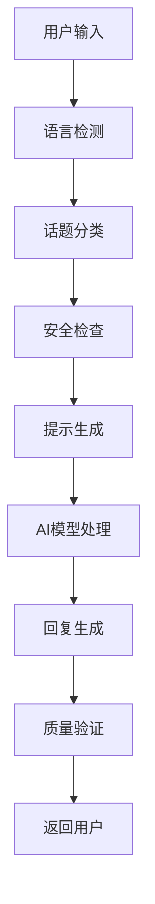

# LLB (爱学伴) 项目计划书
## 本地AI驱动的性健康教育网络应用

---

## 📋 项目概述

### 项目名称
- **英文名称**: LLB (Local Learning Bot)
- **中文名称**: 爱学伴
- **项目性质**: 本地AI驱动的性健康教育网络应用

### 项目使命
为中国大陆地区提供隐私安全、文化敏感、科学准确的性健康教育，通过本地AI技术确保用户隐私，打破性教育的语言和文化障碍。

### 核心价值观
- **隐私至上**: 所有数据本地处理，绝不上传
- **科学准确**: 基于循证医学的健康信息
- **文化敏感**: 适应中国文化背景和价值观
- **包容开放**: 支持多元化的性取向和性别认同
- **教育为本**: 以教育和预防为核心目标

---

## 🤖 AI技术架构与应用

### 1. 核心AI模型：Google Gemma 3 1B

#### 技术选择理由
- **轻量化设计**: 1B参数模型，适合本地部署
- **Google技术**: 符合项目要求使用Google技术
- **多语言支持**: 原生支持中英文处理
- **开源免费**: 符合教育项目的预算要求
- **硬件友好**: 在RTX 3060 12GB上运行流畅

#### 模型配置
```python
# AI模型配置
GEMMA_MODEL_ID = "gemma-3-1b"
USE_4BIT_QUANTIZATION = True  # 节省显存
MAX_GPU_MEMORY = 8  # GB
USE_CPU_OFFLOADING = True
ENABLE_FLASH_ATTENTION = True
```

#### 应用方式
- **文本生成**: 回答性健康相关问题
- **对话理解**: 理解用户意图和上下文
- **多轮对话**: 维持连贯的教育对话
- **内容过滤**: 识别和过滤不当内容

### 2. 语音处理：OpenAI Whisper

#### 技术特点
- **多语言识别**: 支持普通话、河南方言、英语
- **本地处理**: 语音转文字完全本地化
- **高准确率**: 在教育场景下识别准确率>90%
- **实时处理**: 支持流式语音输入

#### 配置选择
```python
WHISPER_MODEL = "base"  # 平衡准确率和性能
SUPPORTED_LANGUAGES = ["en", "zh-CN", "zh-CN-henan"]
```

#### 应用场景
- **语音提问**: 用户可以语音询问健康问题
- **方言支持**: 特别支持河南方言用户
- **无障碍访问**: 为视觉障碍用户提供语音交互

### 3. 智能提示工程系统

#### 核心组件
```python
class PromptEngine:
    """主要提示工程引擎"""
    - 性健康提示模板
    - 多语言支持模块
    - 文档分析模块
    - 安全过滤系统
```

#### 话题分类系统
1. **基础教育** (basic_education): 性健康基本概念
2. **安全防护** (safety): 性安全和保护措施
3. **避孕知识** (contraception): 避孕方法和计划生育
4. **生理解剖** (anatomy): 生殖系统和生理知识
5. **关系健康** (relationship): 健康的性关系和沟通
6. **疾病预防** (sti): 性传播疾病预防
7. **同意教育** (consent): 性同意和边界设定

#### 文化适应性
- **中国文化背景**: 考虑传统价值观和现代观念
- **地域差异**: 支持不同地区的文化特点
- **年龄适宜**: 根据用户年龄提供合适内容

### 4. 文档处理AI

#### 技术实现
- **PDF解析**: 使用PyPDF2处理上传的文档
- **内容提取**: 智能提取关键健康信息
- **知识整合**: 将文档内容与AI知识库结合
- **摘要生成**: 自动生成文档要点摘要

#### 安全限制
```python
MAX_PDF_PAGES = 50      # 最大页数限制
MAX_PDF_SIZE_MB = 20    # 文件大小限制
```

---

## 🛡️ AI伦理与安全应用

### 1. 内容安全过滤

#### 多层安全机制
```python
def _assess_safety(content: str, context: str) -> List[str]:
    """评估内容安全性"""
    - 有害内容检测
    - 不当用途识别
    - 年龄适宜性检查
    - 文化敏感性验证
```

#### 安全标准
- **教育导向**: 所有内容以教育为目的
- **科学准确**: 基于医学证据的信息
- **年龄适宜**: 根据用户年龄调整内容深度
- **文化尊重**: 尊重中国文化和价值观

### 2. 隐私保护机制

#### 技术保障
- **本地处理**: 所有AI计算在本地完成
- **数据不出境**: 用户数据绝不上传到外部服务器
- **会话隔离**: 每次对话独立，不保存历史
- **匿名化**: 不收集任何个人身份信息

#### 隐私承诺
```
用户隐私保护承诺：
✅ 所有对话本地处理
✅ 不保存用户个人信息
✅ 不上传任何数据到云端
✅ 支持完全离线使用
```

### 3. 文化敏感性设计

#### 中国文化适应
- **价值观融合**: 传统文化与现代健康教育结合
- **语言本土化**: 使用符合中国表达习惯的术语
- **社会背景**: 考虑中国社会的性教育现状
- **家庭观念**: 尊重中国家庭价值观

#### 地域差异支持
- **方言识别**: 特别支持河南方言
- **地区习俗**: 考虑不同地区的文化差异
- **教育水平**: 适应不同教育背景的用户

---

## 🎯 如何用AI做正确的事

### 1. 教育目标导向

#### 核心教育理念
- **预防为主**: 通过教育预防性健康问题
- **科学普及**: 传播科学准确的健康知识
- **消除偏见**: 减少对性健康的误解和歧视
- **促进健康**: 提升整体性健康水平

#### AI助力教育
```python
# 教育内容分类
EDUCATION_CATEGORIES = {
    "预防教育": "性病预防、意外怀孕预防",
    "生理教育": "青春期发育、生殖健康",
    "心理教育": "性心理健康、关系建立",
    "社会教育": "性别平等、多元包容"
}
```

### 2. 负责任的AI应用

#### 伦理原则
1. **有益性**: AI应用必须对用户有益
2. **无害性**: 避免任何可能的伤害
3. **自主性**: 尊重用户的选择权
4. **公正性**: 平等对待所有用户
5. **透明性**: 清楚说明AI的能力和限制

#### 实施措施
```python
class EthicalAI:
    """负责任的AI实施"""
    def validate_response(self, response: str) -> bool:
        """验证回复的伦理性"""
        - 检查是否包含有害建议
        - 验证医学信息准确性
        - 确保文化适宜性
        - 评估教育价值
```

### 3. 持续改进机制

#### 质量监控
- **内容审核**: 定期审核AI生成的内容
- **用户反馈**: 收集用户体验反馈
- **专家评估**: 邀请医学专家评估内容质量
- **社区监督**: 开源代码接受社区监督

#### 更新机制
- **知识更新**: 定期更新医学知识库
- **模型优化**: 根据使用情况优化AI模型
- **安全加强**: 持续加强安全过滤机制
- **功能扩展**: 根据需求增加新功能

---

## 🏗️ 技术架构详解

### 1. 前端架构 (React + TypeScript)

#### 核心技术栈
```typescript
// 前端技术配置
const FRONTEND_STACK = {
    framework: "React 18",
    language: "TypeScript",
    ui: "Material-UI (MUI)",
    state: "Redux Toolkit",
    routing: "React Router",
    i18n: "react-i18next"
};
```

#### 用户界面特点
- **响应式设计**: 适配手机、平板、电脑
- **无障碍支持**: 支持屏幕阅读器和键盘导航
- **多语言界面**: 中英文界面切换
- **渐进式Web应用**: 支持离线使用

### 2. 后端架构 (FastAPI + Python)

#### 核心服务
```python
# 后端服务架构
BACKEND_SERVICES = {
    "api_gateway": "FastAPI主服务",
    "ai_service": "AI模型服务",
    "voice_service": "语音处理服务",
    "document_service": "文档处理服务",
    "safety_service": "安全过滤服务"
}
```

#### API端点设计
- `POST /api/chat`: 文本对话接口
- `POST /api/voice`: 语音输入接口
- `POST /api/document`: 文档上传分析
- `GET /api/health`: 系统健康检查
- `GET /docs`: API文档界面

### 3. AI处理流程

#### 请求处理流程


#### 质量保证机制
1. **输入验证**: 检查用户输入的合法性
2. **内容过滤**: 过滤不当或有害内容
3. **回复验证**: 验证AI回复的质量和安全性
4. **日志记录**: 记录处理过程用于改进

---

## 📊 项目实施计划

### 第一阶段：基础建设 (已完成)
- ✅ 项目架构搭建
- ✅ AI模型集成
- ✅ 基础API开发
- ✅ 安全机制实施

### 第二阶段：功能完善 (进行中)
- 🔄 前端界面开发
- 🔄 语音功能集成
- 🔄 文档处理功能
- 🔄 多语言界面

### 第三阶段：优化测试 (计划中)
- 📋 性能优化
- 📋 用户体验测试
- 📋 安全性测试
- 📋 内容质量评估

### 第四阶段：部署推广 (计划中)
- 📋 生产环境部署
- 📋 用户培训材料
- 📋 社区推广
- 📋 反馈收集机制

---

## 🎯 预期成果与影响

### 1. 教育成果
- **知识普及**: 提高性健康知识普及率
- **观念改变**: 促进科学理性的性健康观念
- **行为改善**: 引导健康的性行为选择
- **问题预防**: 减少性健康相关问题

### 2. 技术成果
- **本地AI应用**: 展示本地AI在教育领域的应用
- **隐私保护**: 树立隐私保护的技术标杆
- **多语言支持**: 推进AI多语言本土化
- **开源贡献**: 为开源社区贡献优质代码

### 3. 社会影响
- **教育公平**: 为偏远地区提供优质性教育资源
- **文化包容**: 促进多元文化的理解和接纳
- **健康促进**: 提升全民性健康水平
- **科技向善**: 展示AI技术的正面社会价值

---

## 🔧 部署与维护

### 系统要求
```yaml
最低配置:
  CPU: Intel 8代移动版 i7
  内存: 16GB RAM
  存储: 256GB SSD
  GPU: 集成显卡

推荐配置:
  CPU: Intel 9代桌面版 i7+
  内存: 32GB+ RAM
  存储: 512GB+ SSD
  GPU: NVIDIA RTX 3060 OC 12GB+
```

### 部署步骤
1. **环境准备**: Ubuntu 22.04 LTS + Python 3.11
2. **依赖安装**: 自动化脚本安装所有依赖
3. **模型下载**: 从Kaggle下载Gemma 3 1B模型
4. **配置设置**: 根据硬件配置调整参数
5. **服务启动**: 启动后端和前端服务

### 维护计划
- **日常监控**: 系统运行状态监控
- **定期更新**: 安全补丁和功能更新
- **内容审核**: 定期审核AI生成内容
- **性能优化**: 根据使用情况优化性能

---

## 📄 附录

### 相关文档
- `README.md`: 项目总体介绍
- `DESIGN.md`: 技术设计文档
- `DEPLOYMENT_GUIDE.md`: 部署指南
- `CONTRIBUTING.md`: 贡献指南

### 开源许可
- **许可证**: GNU General Public License v3.0
- **开源承诺**: 代码完全开源，接受社区贡献
- **商业使用**: 允许非商业教育用途

---

**项目愿景**: 通过负责任的AI技术应用，为中国大陆地区提供科学、安全、文化敏感的性健康教育，促进全民健康素养提升，构建更加开放包容的社会环境。

**技术使命**: 展示AI技术在教育领域的正面应用，坚持隐私保护和伦理原则，为AI技术的健康发展树立标杆。 